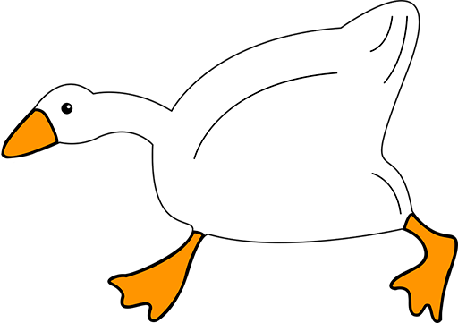
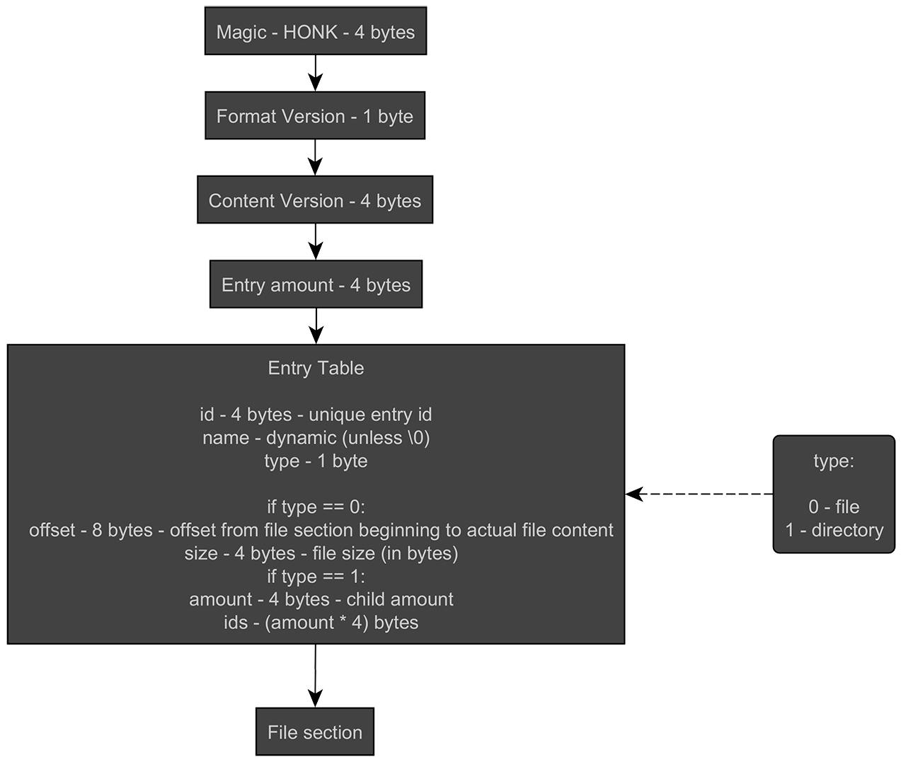

<br />
<p align="center">
   <a href="https://github.com/StarPandaBeg/GooseVF">
    
   </a>

   <h3 align="center">GooseVF - Virtual Filesystem</h3>

   <p align="center">
      Virtual filesystem based on file
   </p>
</p>

---

GooseVF is a _static library_ that provides virtual filesystem based on custom file format named `.honk`. It is useful for game developers to pack their resources to the archive in distribution build.

It doesn't support data compression, it just collects many files into one archive like tar does.

> This project is designed primarily for educational purposes, although it may have practical uses as well

```cpp
using namespace GooseVF;

// Create archive
FileWriter writer;
writer.addFile("test.txt");
writer.addFile("somedir\\42.txt");
writer.save("archive.honk");

// Extract file from archive
FileReader reader("archive.honk");
std::vector<char> buffer;

reader.readFile("test.txt", buffer);

std::ofstream out("test.txt");
out.write(buffer.data(), buffer.size());
```

# Build

### Requirements

- CMake >= 3.16

To build the project please follow the instructions below:

```bash
git clone https://github.com/StarPandaBeg/GooseVF.git
cd GooseVF
cmake -B build -DCMAKE_BUILD_TYPE=Release
cmake --build build --config Release
```

# HONK Format Specification

<div align="center">
  
</div>

# License

Distributed under the MIT License.  
See `LICENSE` for more information.

# Disclaimer

This project is created by C++ beginner developer. It may contain errors or inaccuracies. I would appreciate your feedback and suggestions for improvement. Thanks! 💗
